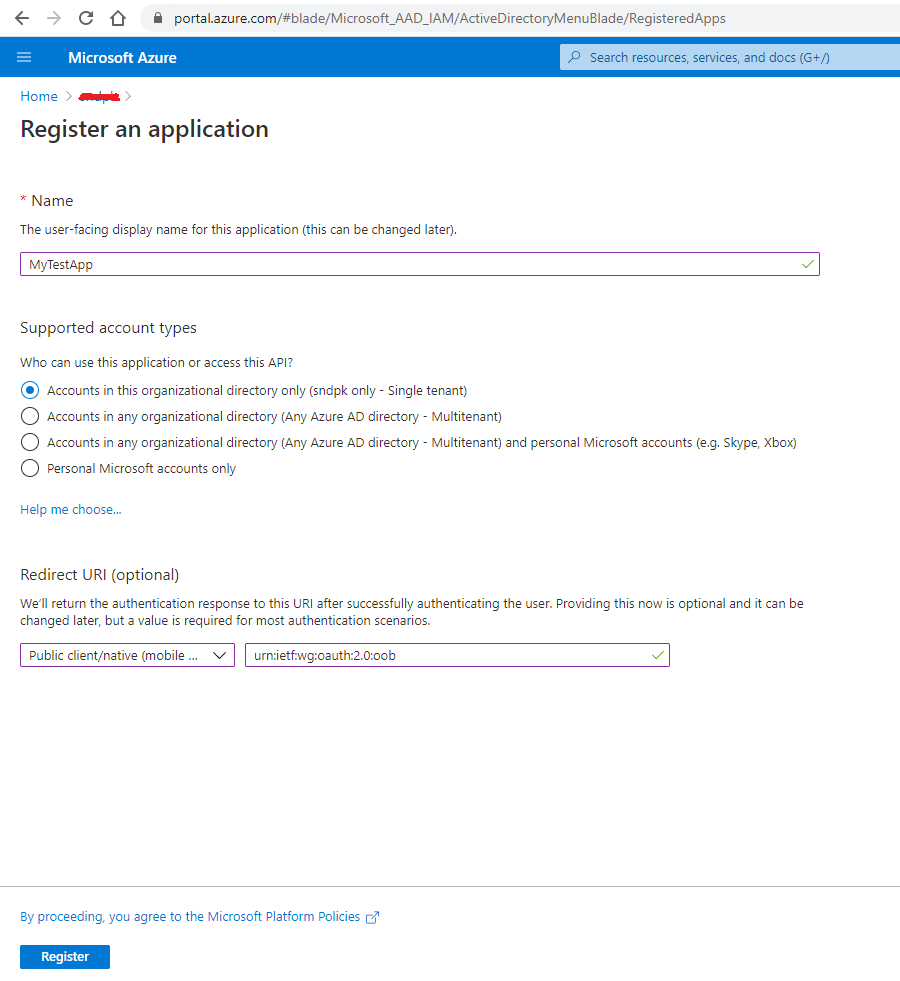
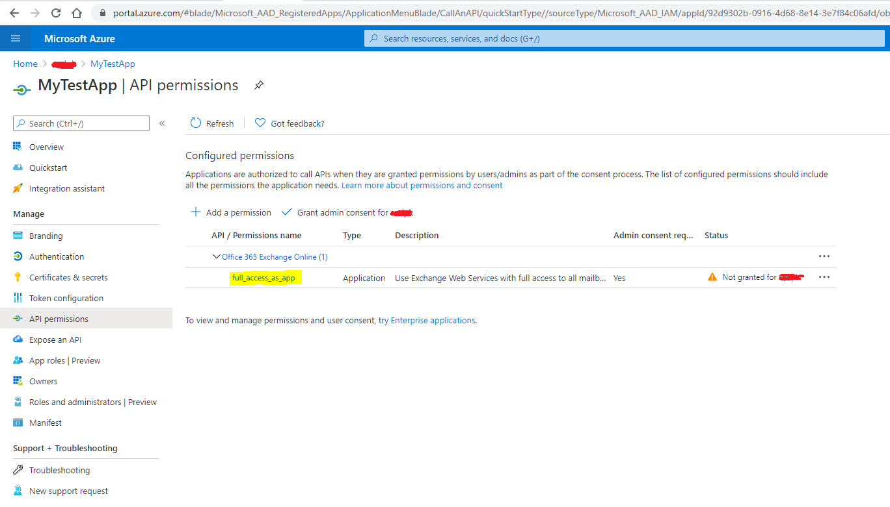
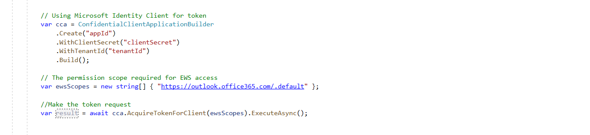

# Introduction 
This is a dotnet core project to connect to Microsoft Exchange Online (Microsoft 365) using EWS (Exchange Web Services) with OAuth2 and read emails.
Exchange Web Services (EWS) is a standard to enable client applications to communicate with the Exchange server. EWS provides access to much of the same data that is made available through Microsoft Office Outlook. SOAP provides the messaging framework for messages sent between the client application and the Exchange server. The SOAP messages are sent over HTTP.

# Background
Microsoft has retired support for basic authentication in EWS to connect to exchange online servers. Basic authentication here means client application passing the username and password with every request. The reason behind ending support for basic authentication is to make the communication more secure by adopting modern authentication ways (OAuth 2.0).
This has forced EWS clients using basic authentication to shift to oauth2 in order to connect to Exchange Online.

This project demonstrate how a background service connects to exchange online using EWS with oauth2 with client credential flow.

**Note:** Use OAuth authentication in all your new or existing EWS applications to connect to Exchange Online. OAuth authentication for EWS is only available in Exchange Online as part of Microsoft 365. EWS applications that use OAuth must be registered with Azure Active Directory first.

# Getting Started
We are going to use OAuth authentication service provided by Azure Active Directory to enable EWS Managed applications to access Exchange Online in Microsoft 365. To use OAuth with our application we will need to:
1.	Register application with Azure Active Directory.

2.	Configure application for app-only authentication.

3.	Add code to get an authentication token.

4.	Add an authentication token to EWS requests.

# Register application with Azure Active Directory
1. To use OAuth, an application must be registeded in azure active directory first. Since ours is a console application, so we need to register it as a public client with Azure Active Directory.

2. Login to azure portal and select Azure Active Direcotry from left panel.

   

3. Click on New registration App registrations.

4. Give a name to your application. Select account type (as per requirement). In Redirect URI, select `Public client/native (mobile & desktop)` and set value to `urn:ietf:wg:oauth:2.0:oob` and click on Register.

   

# Configure application for app-only authentication
Application permissions are used by apps that run without a signed-in user present; for example, apps that run as background services or daemons and can access multiple mailboxes.
1. Select Manifest in the left-hand nav under Manage.

2. Locate the requiredResourceAccess property in the manifest, add the following inside the square brackets ([]) and save.

   

3. Select API permissions under Manage. Confirm that the full_access_as_app permission is listed.

   

4. Select Grant admin consent for <your org> and accept the consent dialog.

5. Select Certificates & Secrets in the left-hand nav under Manage.

6. Select New client secret, enter a short description and select Add.

7. Copy the Value of the newly added client secret and save it, you won't be able to see later for security reasons.

# Add code to get an authentication token
  Use Microsoft Identity Client to get authentication token for your application. Use your tenant id, client id and application secret here.

  

# Add an authentication token to EWS requests
  After receiving the AuthenticationResult object, use the AccessToken property to get the token issued by the token service.

  

   Make an EWS call to list folders or read email from a folder on exhange online.
